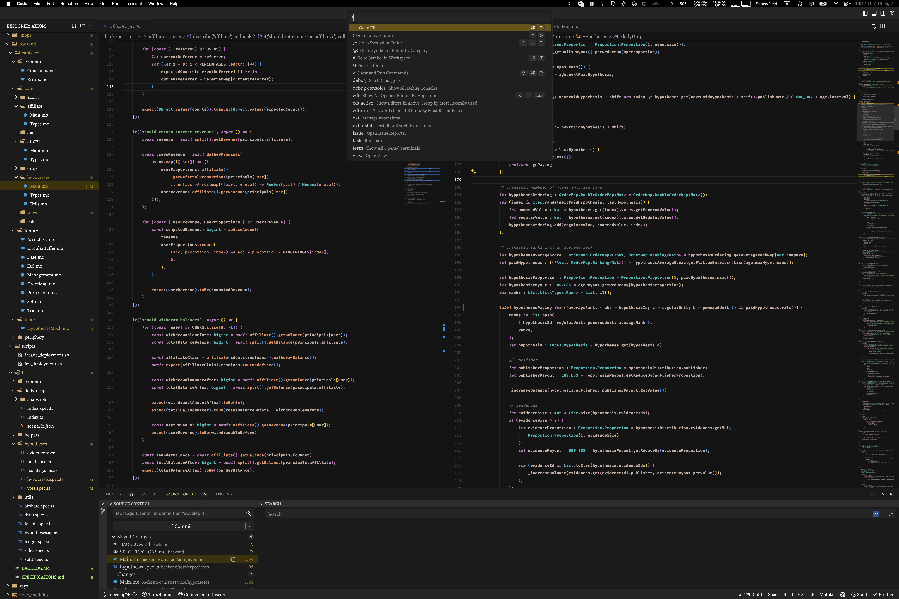
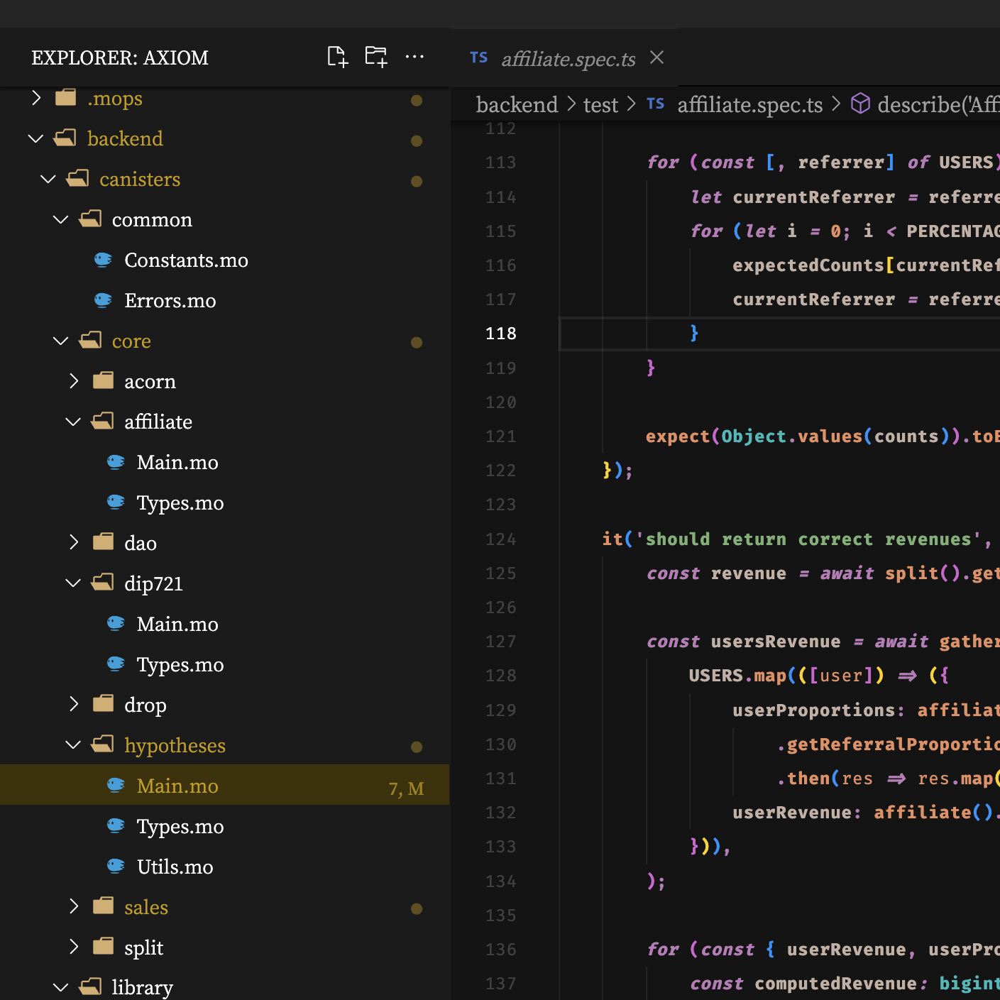
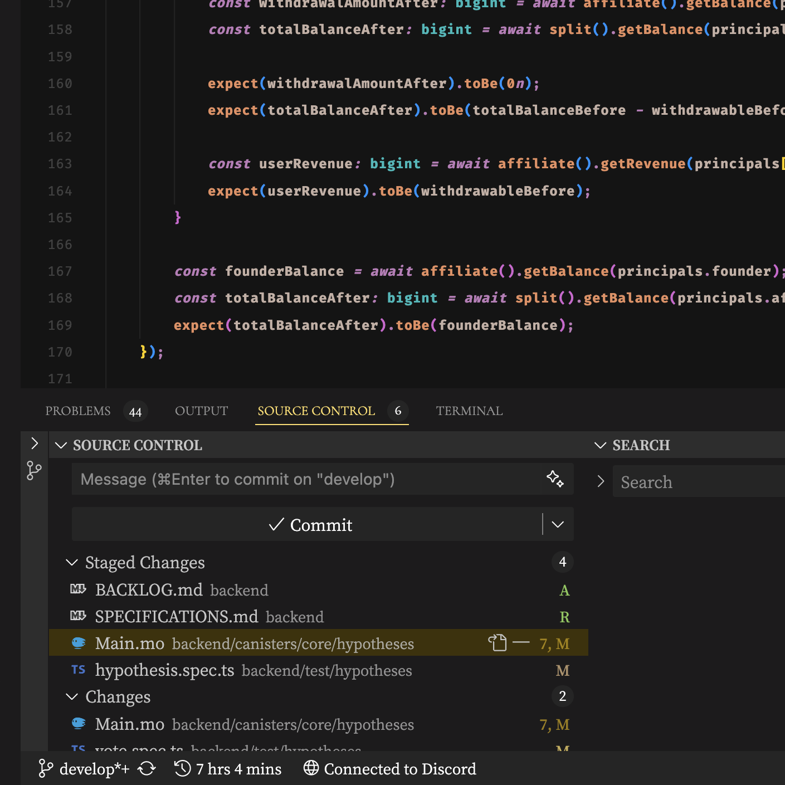
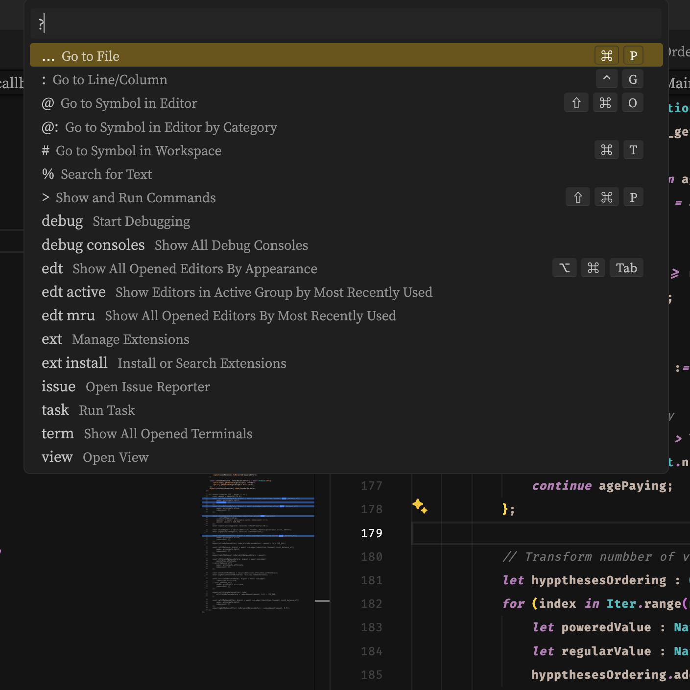

<h1>My Visual Studio Code's UI & theme customizations</h1>
<em>by SnowyField - retro & minimalism inspired</em>
 
 

<figure align="middle">
  
    <figcaption>Layout</figcaption>
 
</figure>
<figure align="middle">
    
  <figcaption>Sidebar (Explorer)</figcaption>
     
</figure>
<figure align="middle">
    
    <figcaption>Panel (Terminal)</figcaption>
     
</figure>
<figure align="middle">
    
    <figcaption>Menu (Command Palette)</figcaption>
     
</figure>

### Scopes of modifications:

- Layout
- Theme
- Syntax Highlighting

### Required extensions:

- [Apc Customize UI++](https://marketplace.visualstudio.com/items?itemName=drcika.apc-extension)
- [Nomo Dark Icon Theme](https://marketplace.visualstudio.com/items?itemName=be5invis.vscode-icontheme-nomo-dark)

### Required fonts:

- [Fira Code](https://fonts.google.com/specimen/Fira+Code)
- [Noto Serif JP](https://fonts.google.com/noto/specimen/Noto+Serif+JP)
- [Cormorant SC](https://fonts.google.com/specimen/Cormorant+SC)
