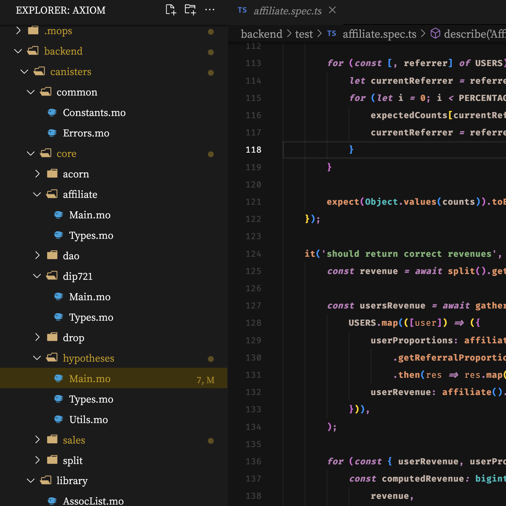
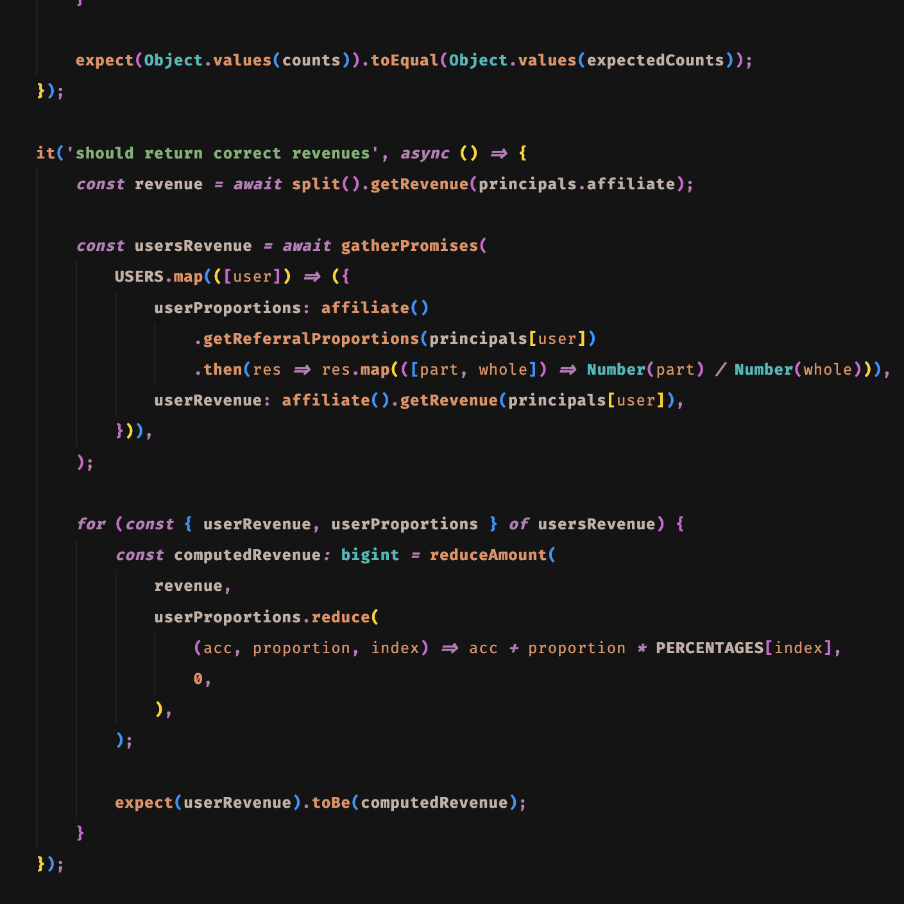

<h1>My Visual Studio Code's UI & theme customizations</h1>
<em>by SnowyField - retro & minimalism inspired</em>
 
 

### Scopes of modifications

- Layout
- Theme
- Syntax Highlighting

### Required extensions

- [Apc Customize UI++](https://marketplace.visualstudio.com/items?itemName=drcika.apc-extension)
- [Nomo Dark Icon Theme](https://marketplace.visualstudio.com/items?itemName=be5invis.vscode-icontheme-nomo-dark)

### Required fonts

- [Fira Code](https://fonts.google.com/specimen/Fira+Code)
- [Noto Serif JP](https://fonts.google.com/noto/specimen/Noto+Serif+JP)
- [Cormorant SC](https://fonts.google.com/specimen/Cormorant+SC)

### Demo

    
    
Layout (3:2 Aspect Ratio Screen)

 

    
    
Sidebar (Explorer)

 

    
    
Panel (Source Control & Search)

 

    
    
Menu (Command Palette)

    
    
Familiar Language Highlighting (TypeScript)

    
    
Unfamiliar Language Highlighting (Motoko)

